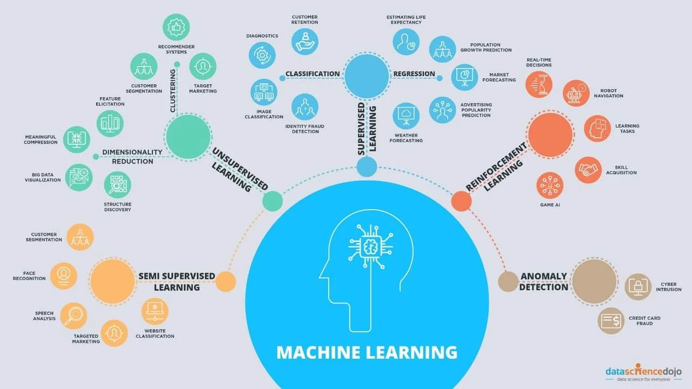
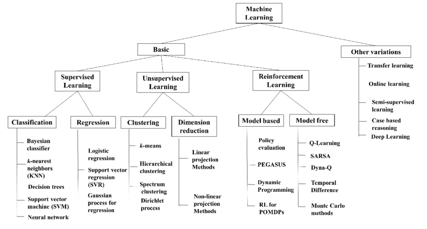

## Types of ML Algorithm

- Supervised Learning
    - Regression
        - Linear Regression
        - Ridge Regression
        - Lasso Regression
        - Support Vector Regression (SVR)
        - Decision Trees Regression
        - Random Forest Regression
        - Gradient Boosting Regression
        - Neural Networks Regression
    - Classification
        - Logistic Regression
        - Support Vector Machines (SVM)
        - k-Nearest Neighbors (k-NN)
        - Naive Bayes
        - Decision Trees
        - Random Forest
        - Gradient Boosting (e.g., XGBoost, LightGBM, CatBoost)
        - Neural Networks (e.g., Multilayer Perceptron)
- Unsupervised Learning
    - Clustering
        - k-Means
        - Hierarchical Clustering
        - DBSCAN (Density-Based Spatial Clustering of Applications with Noise)
        - Gaussian Mixture Models (GMM)
    - Dimensionality Reduction
        - Principal Component Analysis (PCA)
        - t-Distributed Stochastic Neighbor Embedding (t-SNE)
        - Linear Discriminant Analysis (LDA)
        - Independent Component Analysis (ICA)
        - UMAP (Uniform Manifold Approximation and Projection)
    - Association
        - Apriori Algorithm
        - Eclat Algorithm
- Reinforcement Learning
    - Model-Free Methods
        - Q-Learning
        - Deep Q-Network (DQN)
        - SARSA (State-Action-Reward-State-Action)
        - Policy Gradient Methods (e.g., REINFORCE)
    - Model-Based Methods
        - Deep Deterministic Policy Gradient (DDPG)
        - Proximal Policy Optimization (PPO)
        - Trust Region Policy Optimization (TRPO)
    - Value-Based Methods
        - Monte Carlo Methods
        - Temporal Difference (TD) Learning
- Ensemble Learning
    - Bagging (e.g., Random Forest)
    - Boosting (e.g., AdaBoost, Gradient Boosting)
    - Stacking