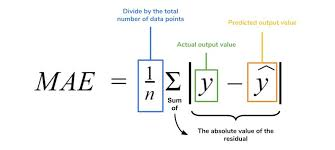

### Characteristics of Regression
Here are the characteristics of the regression:
- Continuous Target Variable: Regression deals with predicting continuous target variables that represent numerical values. Examples include predicting house prices, forecasting sales figures, or estimating patient recovery times.
- Error Measurement: Regression models are evaluated based on their ability to minimize the error between the predicted and actual values of the target variable. Common error metrics include mean absolute error (MAE), mean squared error (MSE), and root mean squared error (RMSE).
Model Complexity: Regression models range from simple linear models to more complex nonlinear models. The choice of model complexity depends on the complexity of the relationship between the input features and the target variable.
Overfitting and Underfitting: Regression models are susceptible to overfitting and underfitting.
Interpretability: The interpretability of regression models varies depending on the algorithm used. Simple linear models are highly interpretable, while more complex models may be more difficult to interpret.

### Some terms
- Outliers: Observations with significantly low or high values compared to others, potentially impacting results and best avoided.
- Multicollinearity: High correlation among independent variables, which can complicate the ranking of influential variables.
- Underfitting and Overfitting: Overfitting occurs when an algorithm performs well on training but poorly on testing, while underfitting indicates poor performance on both datasets.

### ###### Regression Evaluation Metrics or Loss Function for Linear Regression
The loss function helps to quantify how good the model works. 
Here are some most popular evaluation metrics for regression:
- Mean Absolute Error (MAE): MAE works by taking the absolute values of the distance between each data point and the regression line (the red residuals in the graphs above), summing the absolute values, and then dividing by the number of data points.

- Mean Squared Error (MSE): MSE works by squaring the distance between each data point and the regression line (the red residuals in the graphs above), summing the squared values, and then dividing by the number of data points.

- Root Mean Squared Error (RMSE): The square root of the mean squared error.
- Huber Loss: A hybrid loss function that transitions from MAE to MSE for larger errors, providing balance between robustness and MSE’s sensitivity to outliers.
- Root Mean Square Logarithmic Error: 
- R2 Score: The most popular goodness of fit measure for linear regression is r-squared, a metric that represents the percentage of the variance in y explained by our features x. More specifically, r-squared measures the percentage of variance explained normalized against the baseline variance of our model (which is just the variance of the mean):

The highest possible value for r-squared is 1, representing a model that captures 100% of the variance. A negative r-squared means that our model is doing worse (capturing less variance) than a flat line through mean of our data would.