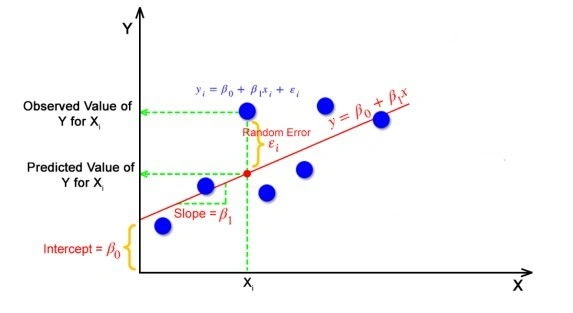
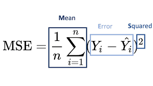
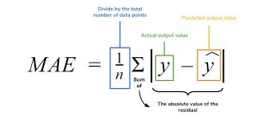
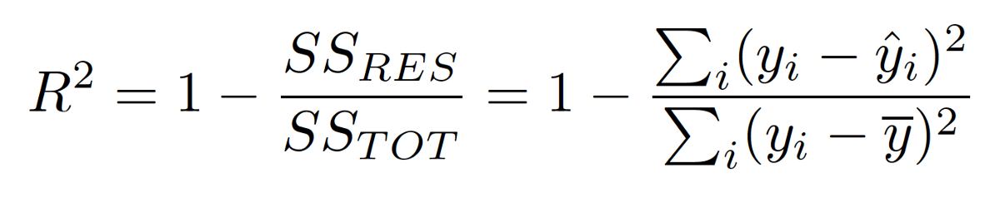
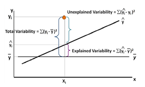

- [Introduction](#introduction)
  - [Simple Linear Regression](#simple-linear-regression)
  - [Multiple linear regression](#multiple-linear-regression)
      - [Best Fit Line](#best-fit-line)
      - [Loss Function for Linear Regression](#loss-function-for-linear-regression)

### Introduction
Linear regression is a supervised machine-learning algorithm, that attempts to model the relationship between the dependent variable and one or more independent features by fitting a linear equation to observed data. by fitting a linear equation to observed data. For example, a modeler might want to relate the weights of individuals to their heights (and/or age) using a linear regression model.
Linear regression can also involve one variable (simple linear regression) or several variables (multiple linear regression) or be adapted for yes/no questions (logistic regression). When there is only one dependent variable, it is considered Univariate Linear Regression, while when there are more than one dependent variables, it is known as Multivariate Regression.
Linear regression fits a straight line or surface that minimizes the discrepancies between predicted and actual output values. 
Linear-regression models are relatively simple and provide an easy-to-interpret mathematical formula that can generate predictions. Linear regression can be applied to various areas in business and academic study. Because linear regression is a long-established statistical procedure, the properties of linear-regression models are well understood and can be trained very quickly.

#### Simple Linear Regression
Simple Linear Regression
This is the simplest form of linear regression, and it involves only one independent variable and one dependent variable. The equation for simple linear regression is:
Y = β0 + β1*X + ε

where:
Y is the dependent variable
X is the independent variable
β0 is the intercept
β1 is the slope
ε is the error term or the residual term

Slope and inetrcept are also called the coefficients.

#### Multiple linear regression
In multiple linear regression analysis, the dataset contains one dependent variable and multiple independent variables. The linear regression line function changes to include more factors as follows:

Y= β0*X0 + β1*X1 + β2*X2 + ... + βn + ε 

Y is the dependent variable
X0, X1, X2, Xn-1 are the independent variables
β0, β1, β2, βn  are the coefficients
ε is the residual/error term

###### Best Fit Line
In simple terms, the best-fit line is a line that best fits the given scatter plot. Mathematically, you obtain the best-fit line by minimizing the Residual Sum of Squares (RSS). Linear Regression aims at finding the best values for the coefficients to find the Best Fit Line.

###### Loss Function for Linear Regression
The loss function helps to quantify how good the model works. Commonly used metrics are:
- Mean-Squared Error (MSE): MSE works by squaring the distance between each data point and the regression line (the red residuals in the graphs above), summing the squared values, and then dividing by the number of data points.

- Mean-Absolute Error (MAE): MAE works by taking the absolute values of the distance between each data point and the regression line (the red residuals in the graphs above), summing the absolute values, and then dividing by the number of data points.

- R-Squared: The most popular goodness of fit measure for linear regression is r-squared, a metric that represents the percentage of the variance in y explained by our features x. More specifically, r-squared measures the percentage of variance explained normalized against the baseline variance of our model (which is just the variance of the mean):

The highest possible value for r-squared is 1, representing a model that captures 100% of the variance. A negative r-squared means that our model is doing worse (capturing less variance) than a flat line through mean of our data would.
