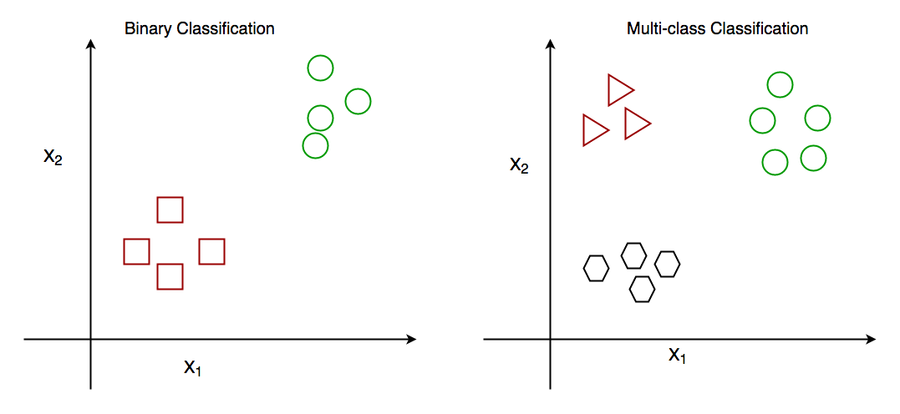

## Supervised Learning
Supervised learning involves training a model on labeled data, where the desired output is known. The model learns to map inputs to outputs based on the provided examples.

### Regression
Regression is a statistical approach used to analyze the relationship between a dependent variable (target variable) and one or more independent variables (predictor variables). The objective is to determine the most suitable function that characterizes the connection between these variables.
In ML, it is a supervised machine learning technique, used to predict the value of the dependent variable for new, unseen data. It models the relationship between the input features and the target variable, allowing for the estimation or prediction of numerical values.
It seeks to find the best-fitting model, which can be utilized to make predictions or draw conclusions.

### Classification
Classification is a process of categorizing data or objects into predefined classes or categories based on their features or attributes. The main objective of classification machine learning is to build a model that can accurately assign a label or category to a new observation based on its features. For example, a classification algorithm could be used to predict whether an email is spam or not.
There are two main classification types in machine learning:
- Binary Classification: In binary classification, the goal is to classify the input into one of two classes or categories. Example – On the basis of the given health conditions of a person, we have to determine whether the person has a certain disease or not.
- Multiclass Classification: In multi-class classification, the goal is to classify the input into one of several classes or categories. For Example – On the basis of data about different species of flowers, we have to determine which specie our observation belongs to.

- Multi-Label Classification: In, Multi-label Classification the goal is to predict which of several labels a new data point belongs to. This is different from multiclass classification, where each data point can only belong to one class. For example, a multi-label classification algorithm could be used to classify images of animals as belonging to one or more of the categories cat, dog, bird, or fish.
- Imbalanced Classification: In, Imbalanced Classification the goal is to predict whether a new data point belongs to a minority class, even though there are many more examples of the majority class. For example, a medical diagnosis algorithm could be used to predict whether a patient has a rare disease, even though there are many more patients with common diseases.

### Regression vs Classification
For regression tasks, the goal is to predict a continuous number, or a floating-point number in programming terms (or real number in mathematical terms), where as for classification tasks, the goal is to predict a class.
An easy way to distinguish between classification and regression tasks is to ask whether there is some kind of continuity in the output. If there is continuity between possible outcomes, then the problem is a regression problem.